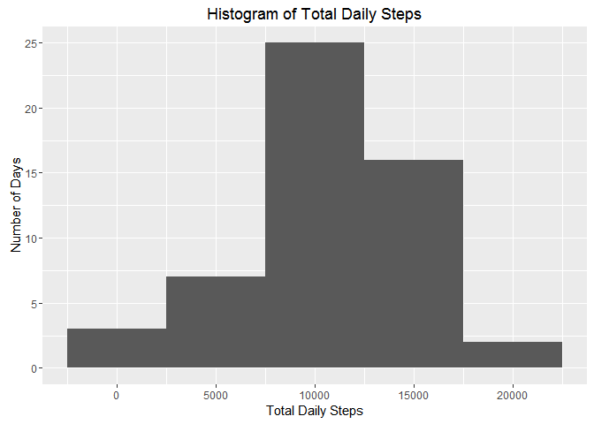
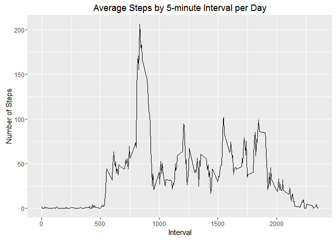
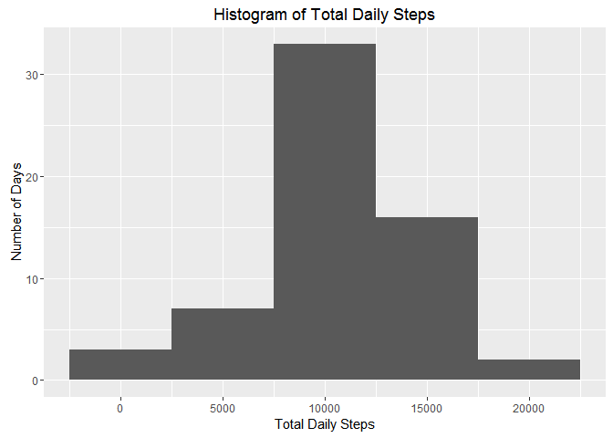
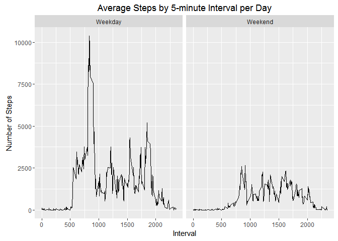

# Reproducible Research: Peer Assessment 1

## Loading and preprocessing the data

First, read in the raw CSV data. Of particular note is that missing values are coded as `NA`. Luckily, this is the default behavior for the read.csv function so we don't require any additional arguments.


```r
data.raw <- read.csv("activity.csv")
```

The dataset should have 17,568 observations, which we can confirm is in the newly read data.

```r
nrow(data.raw)
```

```
## [1] 17568
```


## What is mean total number of steps taken per day?

First, we'll produce a dataset containing total steps taken per day.

```r
data.noNA <- na.omit(data.raw)
data.total_daily_steps <- aggregate(steps ~ date, data = data.noNA, sum)
head(data.total_daily_steps)
```

```
##         date steps
## 1 2012-10-02   126
## 2 2012-10-03 11352
## 3 2012-10-04 12116
## 4 2012-10-05 13294
## 5 2012-10-06 15420
## 6 2012-10-07 11015
```

Next, we'll plot the total number of total steps per day in a historgram.

```r
library(ggplot2)
ggplot(data = data.total_daily_steps, aes(x = steps)) +
      geom_histogram(binwidth = 5000) +
      ggtitle("Histogram of Total Daily Steps") +
      labs(x = "Total Daily Steps", y = "Number of Days")
```

<!-- -->


Below, we can see a summary table of statistics regarding total daily steps. We can also commit the mean and median values to variables for display.

```r
summary(data.total_daily_steps)
```

```
##          date        steps      
##  2012-10-02: 1   Min.   :   41  
##  2012-10-03: 1   1st Qu.: 8841  
##  2012-10-04: 1   Median :10765  
##  2012-10-05: 1   Mean   :10766  
##  2012-10-06: 1   3rd Qu.:13294  
##  2012-10-07: 1   Max.   :21194  
##  (Other)   :47
```

```r
mean <- mean(data.total_daily_steps$steps)
median <- median(data.total_daily_steps$steps)
```

Using the variables above, we can say that the mean number of daily steps is **1.0766\times 10^{4}** and the median number of daily steps is **10765**.


## What is the average daily activity pattern?

The average daily activity pattern can be taken by producing a trend of average steps per 5 minute interval.


```r
data.average_daily_steps <- aggregate(steps ~ interval, data = data.noNA, FUN = function(x) {mean(x)})
ggplot(data = data.average_daily_steps, aes(x = interval, y = steps)) +
      geom_line() +
      ggtitle("Average Steps by 5-minute Interval per Day") +
      labs(x = "Interval", y = "Number of Steps")
```

<!-- -->

## Imputing missing values

First, we'll determine how many missing values there are.

```r
data.missing_vals <- data.raw[!complete.cases(data.raw), ]
nrow(data.missing_vals)
```

```
## [1] 2304
```

Given that there are full days missing, we'll fill missing values for steps with the average steps during that interval. We'll create a duplicate dataset of `data.raw` call `data.filled_NA` that contains the `NA` values filled with these average interval steps. To fill these values, we'll use an aggregated dataset that contains non-missing averages by interval.

```r
data.filled_NA <- data.raw
data.interval_averages <- aggregate(steps ~ interval, data.raw, FUN = function(x){mean(x, na.rm = T)})
for (i in 1:nrow(data.filled_NA)) {
      if (is.na(data.filled_NA$steps[i])) {
            data.filled_NA$steps[i] <- data.interval_averages$steps[data.interval_averages$interval == data.filled_NA$interval[i]]  
      }
}
```

We'll now confirm that there are no missing values in the newly created dataset `data.filled_NA`.

```r
nrow(data.filled_NA[!complete.cases(data.filled_NA),])
```

```
## [1] 0
```

Now that we've confirmed there are no missing values, we can recreate the original historgram with the filled in values.

```r
data.filled_NA_by_day <- aggregate(steps ~ date, data.filled_NA, sum)
ggplot(data = data.filled_NA_by_day, aes(x = steps)) +
      geom_histogram(binwidth = 5000) +
      ggtitle("Histogram of Total Daily Steps") +
      labs(x = "Total Daily Steps", y = "Number of Days")
```

<!-- -->

Finally, we can draw out the new mean and median steps and see if there have been significant changes.

```r
mean(data.filled_NA_by_day$steps)
```

```
## [1] 10766.19
```

```r
mean(data.filled_NA_by_day$steps) - mean(data.total_daily_steps$steps)
```

```
## [1] 0
```

```r
median(data.filled_NA_by_day$steps)
```

```
## [1] 10766.19
```

```r
median(data.filled_NA_by_day$steps) - median(data.total_daily_steps$steps)
```

```
## [1] 1.188679
```

```r
medianchange <- median(data.filled_NA_by_day$steps) - median(data.total_daily_steps$steps)
```

Given that missing values were filled with averages, there has been no change in overall mean steps. However, the median has risen to a similar value as mean, increasing by ``1.1886792`` over the previous median value.

## Are there differences in activity patterns between weekdays and weekends?

In order to determine if weekpart has any impact on average steps, we'll need to convert the date variable to an actual date (instead of a string) and apply the weekday function over the entirety of our `data.Filled_NA` dataset. From here, we can apply the weekday function over the `date` variable to determine if its weekday or weekend. Finally, we'll plot a panel graph for trends.


```r
data.filled_NA$date <- as.Date(data.filled_NA$date, '%Y-%m-%d')

# Add a new weekpart column indicating if its a weekend or weekday.
data.filled_NA$weekpart <- sapply(data.filled_NA$date, FUN = function(x) {
      if (weekdays(x) == "Saturday" || weekdays(x) == "Sunday") {
            "Weekend"
      } else {
            "Weekday"
      }
})

# Create an aggregated dataset.
data.filled_NA_by_weekpart <- aggregate(steps ~ interval + weekpart, data = data.filled_NA, sum)

# Finally, create a new trend graph with weekpart broken out.
ggplot(data = data.filled_NA_by_weekpart, aes(x = interval, y = steps)) +
      geom_line() +
      ggtitle("Average Steps by 5-minute Interval per Day") +
      labs(x = "Interval", y = "Number of Steps") +
      facet_grid(. ~ weekpart)
```

<!-- -->
